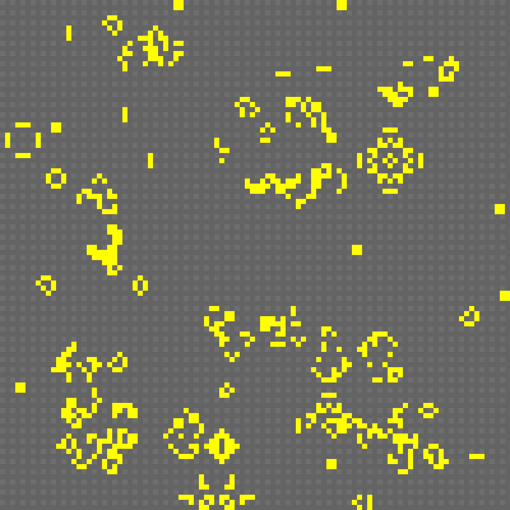

# Game Of Life
Game Of Life cellular automaton simulation application with an interactable interface

# Instructions
Ready to go statically linked Windows binary is available in the [bin](bin/) folder.

To run it the .exe file needs to be in the same folder as the Font and Sprite folders.

## Setup

When running the program you must first enter the desired window width and height into the setup window (default is 1/4 of desktop screen size)

## Input

|Command|Action|
|---|---|
|**Space**|Pause/Unpause the simulation|
|**Up Arrow**|Increase simulation tickrate|
|**Down Arrow**|Decrease simulation tickrate|
|**Backspace**|Reset the simulation|
|**Left Mouse Button**|Populate a cell|
|**Right Mouse Button**|Depopulate a cell|

#

## Compiling the project yourself
The Visual Studio Project uses statically linked SFML 2.5.1 libraries and the SFML 2.5.1 include directory.

No SFML lib or dll files are provided at this time, you must acquire them yourself and link when compiling.

## Compilation options

All options can be found in the GameOfLife.vcxproj file

- Additional include directories: SMFL-2.5.1\include
- Preprocessor definitions: SFML_STATIC (if using static linking)
- Additional library directories: SFML-2.5.1\lib

### Additional dependencies:
- winmm.lib
- opengl32.lib
- freetype.lib
- sfml-graphics-s.lib
- sfml-window-s.lib
- sfml-system-s.lib
- sfml-audio-s.lib
- kernel32.lib
- user32.lib
- gdi32.lib
- winspool.lib
- comdlg32.lib
- advapi32.lib
- shell32.lib
- ole32.lib
- oleaut32.lib
- uuid.lib
- odbc32.lib
- odbccp32.lib
